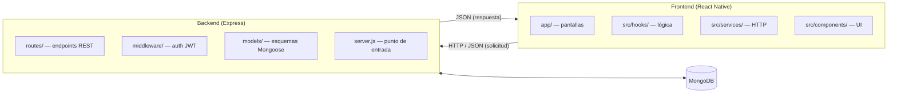

# Arquitectura

NaturApp sigue una arquitectura **modular cliente-servidor** de dos
capas. Cada capa está organizada en módulos independientes con
responsabilidades bien definidas, lo que permite desarrollarlos, probarlos
y mantenerlos por separado.



## Backend

```
server/
├── server.js            # Punto de entrada: conecta módulos y BD
├── seed.js              # Carga datos de ejemplo en MongoDB
├── package.json         # Dependencias del backend
├── models/              # Esquemas de datos (Mongoose)
│   ├── Product.js
│   ├── Category.js
│   ├── User.js
│   └── Order.js
├── routes/              # Endpoints RESTful (un módulo por recurso)
│   ├── productRoutes.js
│   ├── categoryRoutes.js
│   ├── userRoutes.js
│   ├── orderRoutes.js
│   └── cartRoutes.js
└── middleware/
    └── auth.js          # Autenticación y autorización JWT
```

Cada archivo de rutas es un **módulo endpoint** independiente que se
registra en `server.js` bajo un prefijo `/api/...`. El middleware de
autenticación es transversal y se reutiliza en todas las rutas
protegidas.

## Frontend

```
app/                      # Expo Router (file-based routing)
├── index.js              # Redirección a la pestaña principal
├── _layout.js            # Stack raíz (modales y detalle)
├── (tabs)/               # Navegador de pestañas
│   ├── _layout.js
│   ├── home.js
│   ├── search.js
│   ├── cart.js
│   ├── orders.js
│   └── profile.js
├── product/[id].js       # Detalle de producto (ruta dinámica)
├── checkout.js           # Finalizar compra
└── auth/
    ├── login.js
    └── register.js

src/
├── services/apiService.js   # Cliente HTTP centralizado
├── context/                 # Estado global (providers)
│   ├── AuthContext.js       # Sesión y token (restaurado al arrancar)
│   └── CartContext.js       # Carrito compartido entre pantallas
├── hooks/                   # Lógica de negocio (estado + acciones)
│   ├── useProducts.js
│   ├── useCart.js           # reexporta el hook de CartContext
│   ├── useAuth.js           # reexporta el hook de AuthContext
│   └── useOrders.js
└── components/              # UI reutilizable
    ├── ProductCard.js
    ├── CartItemRow.js
    └── CategoryChips.js
```

## Principios aplicados

- **Modularidad** — cada módulo tiene una responsabilidad única
  (`productRoutes` solo gestiona productos, `useCart` solo el carrito).
- **Reutilización** — `ProductCard` se usa en Home y Search; `apiService`
  es el único punto de comunicación con el backend; el middleware `auth`
  se aplica en cualquier ruta protegida.
- **Mantenibilidad** — cambiar la lógica de un recurso solo afecta a su
  módulo. Por ejemplo, modificar el carrito solo toca `cartRoutes.js` y
  `useCart.js`.
- **Separación de capas** — los modelos validan datos, las rutas exponen
  endpoints, los hooks gestionan estado y las pantallas renderizan UI.
