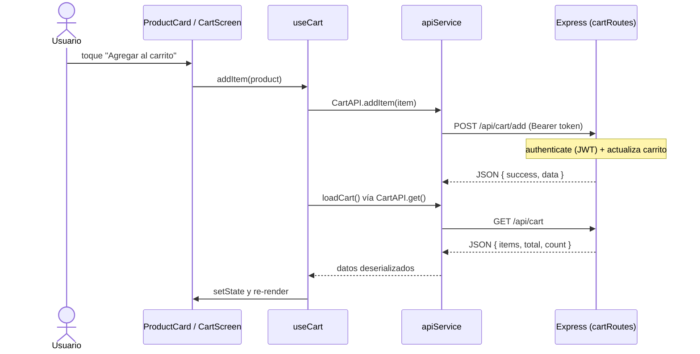

# Flujo de Datos

Este documento describe el ciclo completo de comunicación, desde que el
usuario interactúa con la app hasta que ve el resultado en pantalla. Se
usa como ejemplo la acción **"Agregar al carrito"**.

| Fase | Qué ocurre | Archivos |
|------|-----------|----------|
| 1. Inicio de la solicitud | El usuario pulsa "Agregar al carrito" en `ProductCard`. El evento `onPress` invoca `addItem(product)` del hook `useCart`, que llama a `CartAPI.addItem()`. | `ProductCard.js`, `useCart.js` |
| 2. Viaje por la red | La función `request()` de `apiService.js` construye la solicitud `POST /api/cart/add` con el cuerpo JSON y el header `Authorization: Bearer <token>`. `fetch()` la envía al servidor. | `apiService.js` |
| 3. Procesamiento en el servidor | Express recibe la solicitud en `cartRoutes.js`. El middleware `authenticate` verifica el token JWT. El handler busca el producto en el carrito; si existe incrementa la cantidad, si no lo agrega. Responde con el carrito actualizado. | `auth.js`, `cartRoutes.js` |
| 4. Retorno de datos | La respuesta JSON `{ success, data }` viaja de vuelta al dispositivo. `apiService.js` verifica `response.ok` y deserializa el JSON. | `apiService.js` |
| 5. Renderizado de UI | `useCart` ejecuta `loadCart()`, que actualiza el estado (`setItems`, `setTotal`, `setCount`). React Native detecta el cambio y re-renderiza la pantalla del carrito con el nuevo ítem. | `useCart.js`, `cart.js` |

## Diagrama

## Patrón general

El mismo flujo de cinco fases aplica a cualquier operación de la app
(listar productos, crear un pedido, iniciar sesión, etc.):

1. La pantalla invoca una acción del hook.
2. El hook llama al método correspondiente de `apiService`.
3. El backend autentica (si aplica), procesa y consulta MongoDB.
4. La respuesta JSON regresa y se deserializa.
5. El hook actualiza su estado y la UI se re-renderiza.

Este desacoplamiento por capas hace que cada parte sea sustituible sin
afectar a las demás.
